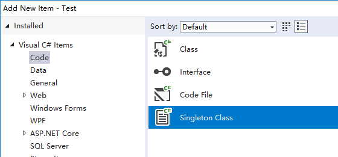
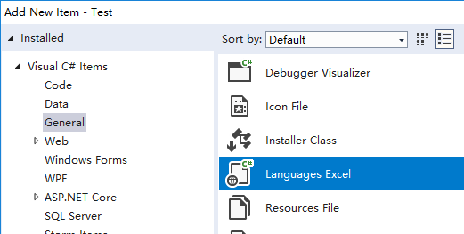
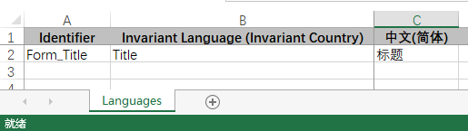
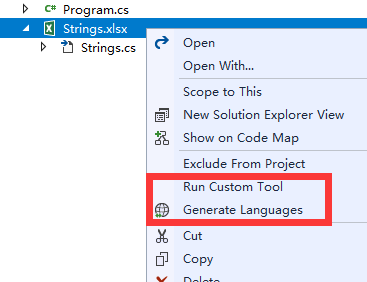
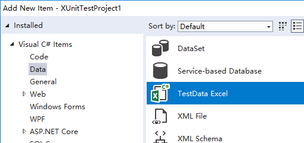

# Lever
## Foundation

### Lever

## Extension
*Lever Visual Studio Extension ToolSuite* is a powerful visual studio extensions help developer improve velocity.  
Only support C# project currently.

**Singleton Class**  
Item Template. The Singleton pattern ensures that a class has only one instance and provides a global point of access to that instance.
1. Right click on project folder, and choose "Add -> New Item...".
1. In the "Add new item" dialog, choose "Singleton Class" under "Code" category.
   
1. Modify filename and click "Add" button.

**Languages Excel**  
Item Template. Languages Excel is an approach which intend to replace the Resx file for internationalization.  
Typically, you use separated "resx" files(Strings.resx, Strings.zh-Hans.resx, Strings.en-US.resx) to provide languages strings.
However, it is difficult to "aligning" entries, which means a string key may miss in other resx file, as well as the interpreters could not easy to guess the meaning from string key.  
1. Right click on project folder, and choose "Add -> New Item...".
1. In the "Add new item" dialog, choose "Languages Excel" under "General" category.
   
1. Modify filename like "Strings.xlsx" and click "Add" button.
1. Ensure "Identifier" is first column and "Invariant Language (Invariant Country)" as second column, and extra "NativeName" from "References" worksheet.
   
1. By cooperating with interpreter, edit "Languages" worksheet for your business requirement and save.
1. Right click "Strings.xlsx" in "Solution Explorer" window, and choose "Run Custom Tool" (or "Generate Languages" if excel file is opened).
   

**TestData Excel**  
Item Template. TestData Excel used for provide test data for XUnit.Net ```[Theory]``` test method.  
1. Right click on project folder, and choose "Add -> New Item...".
1. In the "Add new item" dialog, choose "TestData Excel" under "Data" category.
   
1. Modify filename like "TestData.xlsx" and click "Add" button.
1. Assume you have follow XUnit.net test class `FoundationShould`, ignore `[ExcelTestData]` error in this moment.
```csharp
namespace XUnitTestProject1
{
    public class FoundationShould
    {
        [Theory]
        [ExcelTestData]
        public void AddTest(int x, float y, float expected)
        {
            float result = x + y;
            Assert.Equal(expected, result);
        }

        [Theory]
        [ExcelTestData]
        public void EncodingSubString(byte[] data, int index, int length, string expected)
        {
            string result = Encoding.UTF8.GetString(data, index, length);
            Assert.Equal(expected, result);
        }
    }
}
```
5. Edit "TestData.xlsx", make sure sheet name is match with test class name, and insert rows. Each row consist of Method name and Parameter0-9.
1. 